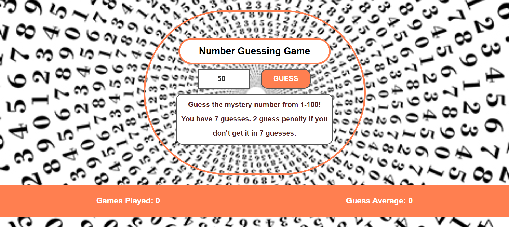

# Number Guessing Game

## Game Info
The game runs when the user clicks the PLAY button.

- Guess the number between 1 - 100
- If the guess is either high or low, user gets a feedback regarding if it's too LOW or too HIGH and guesses again
- User gets 7 guesses in total
- Reset upon correct answer or 7 guesses

## Technologies
This project is run on javascript.

## Deployment
Go to [https://jchen2190.github.io/numberGuessGame/](https://jchen2190.github.io/numberGuessGame/)